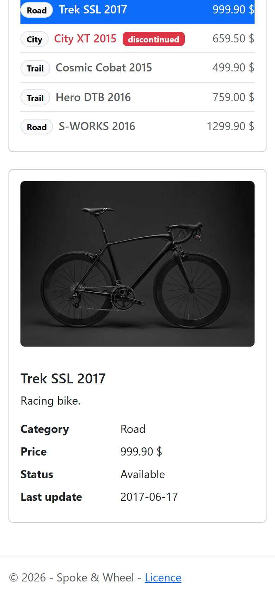

# spoke-and-wheel

[](https://github.com/Arthure-code/spoke-and-wheel/actions/workflows/build.yml)
[](https://sonarcloud.io/summary/new_code?id=Arthure-code_spoke-and-wheel)
[](https://sonarcloud.io/summary/new_code?id=Arthure-code_spoke-and-wheel)
[](https://sonarcloud.io/summary/new_code?id=Arthure-code_spoke-and-wheel)
[](https://sonarcloud.io/summary/new_code?id=Arthure-code_spoke-and-wheel)
[](https://sonarcloud.io/summary/new_code?id=Arthure-code_spoke-and-wheel)
[](https://sonarcloud.io/summary/new_code?id=Arthure-code_spoke-and-wheel)

A small bike shop's catalogue: road, city and trail bikes in an array,
rendered by one Vue component with a description, a price, and a red line
for the model that is discontinued. Search by name, sort by name, price or date
in either direction, page through two at a time; click a bike and a second
component shows its picture and every detail under the list.

Vue 3 with `<script setup>`, built by Vite, styled with Bootstrap. Two
components, four props, one event, a handful of `ref`s and the computed
chain filtered, sorted, paginated.

## Screenshots




## How it works

**The data lives in `App.vue`, the rendering in `ProductList.vue`.** The
array of products is declared once in the root component and handed down as
a prop; the list component declares that prop with `defineProps` and never
changes it.

**One `v-for`, one `:key`.** The list renders a button per product, keyed on
the product's `id` so Vue can track each row if the array ever changes.

**Search, sort and paging are a chain of computed properties.** The search
field is bound with `v-model` to `filterName`; `filteredProducts` keeps the
names that match it, case-insensitive. `sortedFilteredProducts` copies that
result and sorts it on the property named by `sortName`; a second click on
the same button flips `sortDir`. `sortedFilteredPaginatedProducts` slices
one page of `perPage` bikes, a prop the parent sets to 2. Nothing is
recomputed unless one of its inputs changes.

**Changing the page drops the selection.** A `watch` on the page number
emits `select` with `null`; a new search or a new order also brings the
page back to 1, so the pager never points past the end of a shorter list.

**The click goes up, the selection comes down.** A row emits `select` with
its product; `App.vue` keeps the chosen one in a `ref` and passes it back to
the list, which highlights the matching row, and to `ProductDetail.vue`,
which renders it. The child components hold no state of their own.

**The pictures are linked, not stored.** Each product carries an `imageUrl`
pointing at a public photo on [Unsplash](https://unsplash.com/license), and
the detail card binds it with `:src`; no image file lives in the repository.

**Colour is a class, bound to a boolean.** `:class="{ discontinued:
product.discontinued, selected: isSelected(product) }"` puts a class on
the row; the scoped CSS of the component turns the cells red or blue.
Nothing about colour is written in the script, and every pair of colours
reaches the 4.5:1 contrast of WCAG AA.

**The logo is an SVG drawn for the shop.** Imported by the root component
and used twice, in the navigation bar and above the title, with an empty
`alt` since the name sits right next to it.

**The title is a plain constant in the component.** `const title = 'Our
bikes'` in `<script setup>` is available to the template as is; no `ref`
is needed for a value that never changes.

## Running it

```bash
npm install
npm run dev
```

`npm run build` writes the static site to `dist/`, which can be served from
any web server.

## Tests

```bash
npm test
```

Sixteen Vitest tests mount the components with Vue Test Utils and drive
them the way a person would: type in the search field, click the sort
buttons twice, page to the end and back, click a bike. `npm run coverage`
adds the coverage report, which the workflow hands to SonarCloud.

## Stack

Vue 3.5 with `<script setup>`, Vite 8, Bootstrap 5.3 for the page frame
and scoped CSS for the list. Two components, no router, no store, no other
runtime dependency. Vitest and Vue Test Utils for the tests. The bike photos are public pictures
on Unsplash, linked by URL.

## Résumé

Le catalogue d'une petite boutique de vélos, route, ville et sentier, dans
un tableau rendu par un composant Vue, avec une description, un prix et
une ligne rouge pour le modèle discontinué. On cherche par nom, on trie par
nom, prix ou date dans les deux sens, on tourne les pages deux vélos à la
fois, le tout par une chaîne de propriétés calculées. Un clic sur un vélo
affiche sa photo et tous ses détails dans un second composant, sous la
liste; changer de page efface la sélection. Le tableau et
le vélo choisi vivent dans `App.vue` ; la liste les reçoit par props, ne les
modifie jamais, et remonte le clic par un événement `select`. Les photos
sont des images publiques d'Unsplash, liées par adresse, rien n'est stocké
dans le dépôt. Vue 3.5 avec `<script setup>`, compilé par Vite 8.

## Licence

MIT. See [LICENSE](LICENSE).
